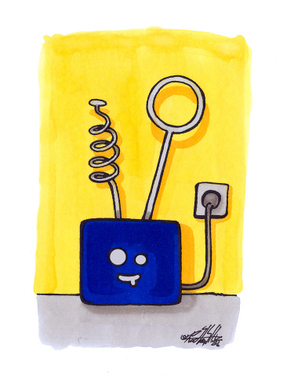
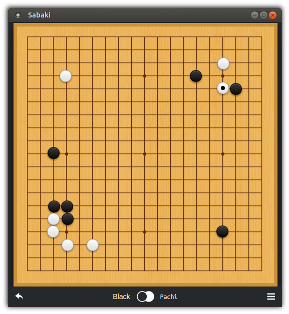
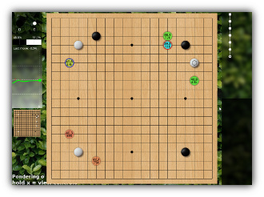

Pachi
=====

Pachi can refer to: a simple modular framework for programs playing
the game of Go/Weiqi/Baduk, and a reasonably strong engine built
within this framework.

## Engine

The default engine plays by Japanese or Chinese rules and should be about
7d KGS strength on 9x9. On 19x19 it can hold a solid KGS 2d rank on modest
hardware (Raspberry Pi, dcnn) or faster machine (e.g. six-way Intel i7)
without dcnn.

When using a large cluster (64 machines, 20 cores each), it maintains
KGS 3d to 4d and has won e.g. a 7-stone handicap game against Zhou Junxun 9p.

By default, Pachi uses the UCT engine that combines Monte Carlo approach
with tree search; UCB1AMAF tree policy using the RAVE method is used for
tree search, while the Moggy playout policy using 3x3 patterns and various
tactical checks is used for the semi-random Monte Carlo playouts. MM patterns
and deep learning are used to guide tree search.

## Binary Releases

**Linux / Windows**: Download [binary release](https://github.com/pasky/pachi/releases)
and follow instructions inside.

**Ubuntu**: Install 'pachi-go' package from [ppa](https://launchpad.net/~lemonsqueeze/+archive/ubuntu/pachi):

    sudo add-apt-repository ppa:lemonsqueeze/pachi
    sudo apt-get update
    sudo apt-get install pachi-go

For build instructions see [INSTALL](INSTALL.md).

## Setup

The `pachi` binary program is a GTP client. Use it with your favorite
Go program interface (e.g. [gogui][1], [sabaki][2], [lizzie](#Lizzie)),
or use [kgsGtp][3] to connect it to KGS.

> DO NOT make the GTP interface accessible directly to untrusted users
> since the parser is not secure - see [HACKING](HACKING?raw=true)
> for details.

[1]: https://sourceforge.net/projects/gogui/
[2]: http://sabaki.yichuanshen.de/
[3]: http://www.michna.com/kgsbot.htm

The pachi program can take many parameters. The defaults should be fine
for initial usage, see below for more tips.

## Deep Learning

Pachi uses a neural network as source of good moves to consider (policy network).
With dcnn support Pachi can play at dan level on modest hardware.
For large number of playouts this makes it about 1 stone stronger and
makes the games more pretty. A raw dcnn engine is available for
pure dcnn play (not recommended for actual games, pachi won't know
when to pass or resign !).

`pachi --list-dcnn`    List supported networks.  
`pachi --dcnn=name`    Choose network to use (Detlef's 54% dcnn by default).

Releases come with Detlef's 54% dcnn by default.  
For other networks see [Pachi Networks](https://github.com/pasky/pachi/releases/tag/pachi_networks).

Currently dcnn is used for root node only.

## How to run

By default Pachi will run on all cores and take a little under 10 seconds
per move (no pondering). You can adjust these parameters by passing it
extra command line options.

For main options description try:

        pachi --help

**Time Settings**

Pachi can smartly deal with a variety of time settings (canadian byoyomi
recommended to maximize efficient time allocation). However, most of these
are accessible only via GTP, that is by the frontend keeping track of time,
e.g. KGS or gogui.

It's also possible to force time settings via the command line
(GTP time settings are ignored then):

* `pachi -t 20        `     20s per move.
* `pachi -t _600       `     10 minutes sudden death.
* `pachi -t =5000       `     5000 playouts per move.
* `pachi -t =5000:15000   `      Think more when needed (up to 15k playouts)
* `pachi -t =5000:15000 --fuseki-time =4000`     Don't think too much during fuseki.

**Fixed Strength**

Pachi will play fast on a fast computer, slow on a slow computer, but strength
will remain the same:

* `pachi -t =5000:15000 --dcnn=df `   kgs 3d
* `pachi -t =5000:15000       `       kgs 2d
* `pachi -t =5000 --nodcnn      `     kgs 3k (mcts only).

**KGS**

Use `pachi --kgs --josekifix` when playing on KGS.

See [kgsgtp.conf](kgs/kgsgtp-pachi.conf?raw=true) for example setup.  
You want joseki fixes working if playing ranked games
(see [MORE](MORE.md) and josekifix [README](josekifix/README.md) for details).

**Other Options**

* `pachi --modern-joseki`        Play modern josekis

* `pachi resign_threshold=0.25`     Resign when winrate < 25% (default: 20%).

* `pachi reportfreq=1s`         Show search progress every second (default: 1000 playouts).

* `pachi -t 30 threads=4,max_tree_size=500,pondering`

  Play with 30s per move on 4 threads, using max 500Mb of memory for tree
  search and thinking during the opponent's turn as well.

* `pachi -t _1200 --nodcnn threads=8,max_tree_size=3072`

  Play without dcnn with time settings 20:00 S.D. on 8 threads,
  taking up to 3Gb of memory.

For now, there is no comprehensive documentation of engine options, but
you can get a pretty good idea by looking at the uct_setoption() function
in [uct/uct.c](uct/uct.c) - you will find the list of UCT engine options
there, each with a description. At any rate, usually the four options above
are the only ones you really want to tweak.

## Analyze commands

When running Pachi through GoGui, a number of graphic tools are available
through the `Tools -> Analyze commands` window:

- Best moves
- Score estimate
- DCNN ratings ...

It's also possible to visualize best moves / best sequence while Pachi is thinking
via the live gfx commands.

## Lizzie

It's also possible to run Pachi with [Lizzie](https://github.com/featurecat/lizzie) to analyze things !  
This is a great way to explore variations, analyze games or visualize what Pachi is doing while it's thinking,
the graphics are amazing.

Setup:
- Install [Lizzie](https://github.com/featurecat/lizzie/releases)
- Get [Pachi](https://github.com/pasky/pachi/releases), extract in Lizzie folder
- Configure engines:  
  Start Lizzie, `Menu -> Settings -> Engine`  
  Normally Leela-zero and Katago the first two engines.  
  Add Pachi as "Engine 1":
  
      Engine 1:  pachi/pachi.exe -o pachi.log

- Lizzie will start with Leela-zero by default,  
  use `Menu -> Engine -> Engine 1` to switch to Pachi.  
  (Window title shows current engine).

## Logs

Pachi logs details of its activity on stderr, which can be viewed via
`Tools -> GTP Shell` in gogui. Tons of details about winrates, memory usage,
score estimate etc can be found here. Even though most of it available through
other means in gogui, it's always a good place to look in case something
unexpected happens.

`-d <log_level>` changes the amount of logging (-d0 suppresses everything)  
`-o log_file` logs to a file instead. gogui live-gfx commands won't work though.

## More

See [HACKING](HACKING?raw=true) for a more detailed developer's view of Pachi,  
[MORE](MORE.md) for more details, other engines and game analysis tools.

Also, if you are interested about Pachi's architecture, algorithms
etc., consider taking a look at Petr Baudis' Master's Thesis:

http://pasky.or.cz/go/prace.pdf

...or a slightly newer scientific paper on Pachi:

http://pasky.or.cz/go/pachi-tr.pdf

## Licence

Pachi is distributed under the GPLv2 licence (see the [COPYING](COPYING?raw=true)
file for details and full text of the licence); you are welcome to tweak
it as you wish (contributing back upstream is welcome) and distribute
it freely, but only together with the source code. You are welcome
to make private modifications to the code (e.g. try new algorithms and
approaches), use them internally or even to have your bot play on the
internet and enter competitions, but as soon as you want to release it
to the public, you need to release the source code as well.

One exception is the Autotest framework, which is licenced under the
terms of the MIT licence (close to public domain) - you are free to
use it any way you wish.
