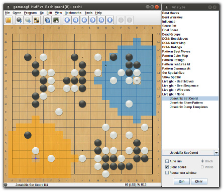

## Joseki overrides

This is the josekifix module. It allows to override the main engine moves
to fix joseki / fuseki lines that the dcnn plays poorly, play more modern
josekis (--modern-joseki option), or play more varied fusekis as black.

It uses Katago as external joseki engine and a pattern matcher to look for
overrides in current board position.

Most overrides are specified in SGF form
([josekifix.sgf](josekifix.sgf?raw=true), [fusekifix.sgf](fusekifix.sgf?raw=true)),
which are loaded at startup after being converted to a GTP stream (josekifix.gtp).
In the SGF file overrides are represented by `[override]` sections inside move
comments with required metadata.

Matching is based on last move and the local pattern around it (or a point
nearby) but can optionnally include things like ladder checks, or pattern
at another location (useful to check both corners in fuseki overrides for
example).

See demo in [josekifix.sgf](josekifix.sgf?raw=true) for details.

## External joseki engine

Overrides can either specify next move ("just override this move"), or let
external joseki engine take over the following sequence in this quadrant.

While it's possible in theory to provide all answers to all possible deviations,
in practice it's much more manageable to depend on an external engine for tricky
variations that Pachi tends to get wrong in many different ways. The downside is
that if the external engine is missing at runtime the josekifix module will be
disabled.

	pachi --josekifix

Running with `--josekifix` option ensures that Pachi never runs without joseki fixes
(abort if necessary).

	pachi --external-joseki-engine "command"

Katago cpu build that comes with Pachi is used by default.
Use this to use another engine as joseki engine.

## Start

When all is setup and working correcly you should see something like this on
startup:

    $ pachi --external-joseki-engine "/path/to/katago gtp"
    Random seed: 1675600712
    External engine: KataGo version 1.11.0
    Loading joseki fixes ...
    Loaded 132 overrides.
    Loaded Detlef's 54% dcnn for 19x19
    ...

## Updates

Minor updates to the SGF database are kept in a different branch
([joseki_fixes](https://github.com/pasky/pachi/tree/joseki_fixes))
to avoid polluting the git history too much.

If you're using a Pachi release, or even Pachi git repository, the included SGF
database is likely not the latest.

To get latest joseki fixes, run:

    $ git clone https://github.com/pasky/pachi
    $ cd pachi/josekifix
    $ make update
   
That should get you the latest sgf database and regenerate `josekifix.gtp`
(parent directory).

Copy `josekifix.gtp` to the directory where Pachi runs and Pachi should pick
it up next time it starts.

## Adding new overrides

Edit [josekifix.sgf](josekifix.sgf?raw=true) / [fusekifix.sgf](fusekifix.sgf?raw=true)
to add new overrides (see demo in josekifix.sgf to get started).

Find an SGF editor that lets you visualize move tree and comments easily:

- cgoban3 (KGS client), Sabaki etc all work well.
- GoGui is not ideal for navigating branches (doesn't draw the move tree !)
  but can be workable if you show info panel (comments).

  The fact that it can show pattern areas interactively at different locations
  can be of great help to visualize things.

  You need to attach Pachi engine first.  
  Then try clicking different locations after clicking:

      Tools -> Analyze Commands -> Josekifix Set Coord -> Run

  - orange area is matching pattern area for that location
  - blue area the one around last move

Once done sgf editing, regenerate database with:

    $ cd josekifix
    $ make data

## Logs

When an override or logged variation matches, logs show override move, name and move number:

    joseki_override (move 20): R3 (magic sword)				(override)
    joseki_variation (move 9): A1 (magic sword cut v2)			(logged variation)

When external joseki engine mode triggers ascii board diagram headers show 
number of external engine moves remaining in each quadrant:

In this case, 15 moves remaining in upper-left and lower-right   (order: [UL UR LR LL])
    
    Move:   7  Komi: 6.5  Handicap: 0  Captures B: 0 W: 0 [15 0 15 0]
          A B C D E F G H J K L M N O P Q R S T        A B C D E F G H J K L M N O P Q R S T
        +---------------------------------------+    +---------------------------------------+
     19 | . . . . . . . . . . . . . . . . . . . | 19 | : : : : : : : : : : : : : : : : : : : |
     18 | . . . . . . . . . . . . . . . . . . . | 18 | : : : : : : : : : : : : : : : : : : : |
     17 | . . . . . . . . . . . . . . . . . . . | 17 | : : : : : : : : : : : : : : : : : : : |
     16 | . . . . . . . . . . . . . . . . X . . | 16 | : : : : : : : : : : : : : : : : : : : |
     15 | . . X . . . . . . . . . . . . . . . . | 15 | : : : : : : : : : : : : : : : : : : : |
     14 | . . . . . . . . . . . . . . . . . . . | 14 | : : : : : : : : : : : : : : : : : : : |
     13 | . . . . . . . . . . . . . . . . . . . | 13 | : : : : : : : : : : : : : : : : : : : |
     12 | . . . . . . . . . . . . . . . . . . . | 12 | : : : : : : : : : : : : : : : : : : : |
     11 | . . . . . . . . . . . . . . . . . . . | 11 | : : : : : : : : : : : : : : : : : : : |
     10 | . . . . . . . . . . . . . . . . . . . | 10 | : : : : : : : : : : : : : : : : : : : |
      9 | . . . . . . . . . . . . . . . . . . . |  9 | : : : : : : : : : : : : : : : : : : : |
      8 | . . . . . . . . . . . . . . . . . . . |  8 | : : : : : : : : : : : : : : : : : : : |
      7 | . . . . . . . . . . . . . . . . . . . |  7 | : : : : : : : : : : : : : : : : : : : |
      6 | . . X). . . . . . . . . . . . . . . . |  6 | : : : : : : : : : : : : : : : : : : : |
      5 | . . . . . . . . . . . . . . . O . . . |  5 | : : : : : : : : : : : : : : : : : : : |
      4 | . . . O . . . . . . . . . . . . . . . |  4 | : : : : : : : : : : : : : : : : : : : |
      3 | . . . . . . . . . . . . . . X . O . . |  3 | : : : : : : : : : : : : : : : : : : : |
      2 | . . . . . . . . . . . . . . . . . . . |  2 | : : : : : : : : : : : : : : : : : : : |
      1 | . . . . . . . . . . . . . . . . . . . |  1 | : : : : : : : : : : : : : : : : : : : |
        +---------------------------------------+    +---------------------------------------+

## Debugging

To dump all overrides loaded on startup, run:

    $ ./pachi -d4
    
To dump all overrides loaded on startup, including positions leading to the
overrides, run:

    $ ./pachi -d5

